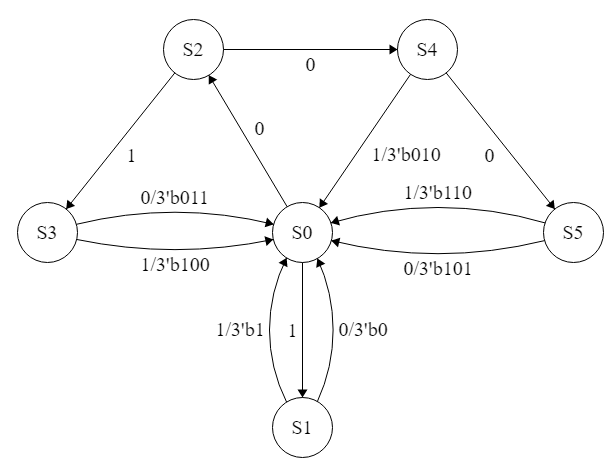

# Huffman Decoder
Huffman code is a lossless data compression scheme, this design is a simple huffman receiver. It has a single bit data-in line and a 3-bit data-out line.

The data is received in a pre-calculated huffman coding scheme and decoded to plain binary accodring to the following table:
| Huffman Code | Binary Code |
| ----------- | ----------- |
| 2'b01  | 3'b000 |
| 2'b11  | 3'b001 |
| 3'b001 | 3'b010 |
| 3'b010 | 3'b011 |
| 3'b011 | 3'b100 |
| 4'b0000| 3'b101 |
| 4'b0001| 3'b110 |

The decoding process is done according to the following mealy finite state machine:
